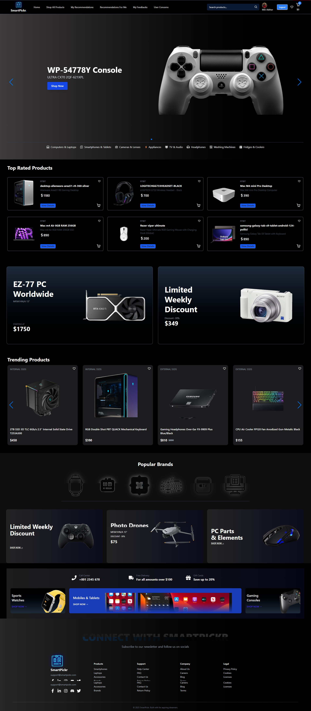

# 🚀 SmartPickr – Smart Product Recommender App

SmartPickr is a full-stack web application where users can submit product-related queries and receive community-driven product recommendations. Designed for tech enthusiasts and shoppers to find the best product alternatives based on real feedback.

🌐 **Live Demo**: [SmartPickr Live](https://smart-pickr.web.app)

---

## 🛠 Technologies Used

- **React JS** – Frontend library  
- **Tailwind CSS & DaisyUI** – Styling & responsive UI components  
- **React Router** – Page routing  
- **Node.js & Express.js** – Backend server  
- **MongoDB** – NoSQL database  
- **Firebase Auth** – Authentication system  
- **Custom Hooks** – Optimized reusable logic  
- **Swiper JS / Framer Motion** – Smooth animations  
- **JSON Server / Custom Backend API** – Mock and real data operations  

---

## ✨ Key Features

- 🔐 Secure user authentication with Firebase  
- 📝 Post a query to get help on choosing tech products  
- 📬 Receive recommendations from other users  
- 📊 View your personal and top-rated recommendations  
- ❤️ Upvote (mark helpful) on good suggestions  
- 🗑 Delete or update your recommendations  
- 🔍 Filter product recommendations by category or product name  
- 🎨 Animated UI with **Framer Motion** and **Swiper.js**  

---

## 🏠 Screenshots

### Home Page  


---

## 📁 Folder Structure (Client Side)

```
smart-pickr-client/
│
├── public/
│   └── index.html
│
├── src/
│   ├── assets/
│   ├── components/
│   │   ├── Navbar.jsx
│   │   ├── Footer.jsx
│   │   ├── RecommendationCard.jsx
│   │   └── ...
│   ├── hooks/
│   │   └── useAuth.js
│   ├── layouts/
│   │   └── MainLayout.jsx
│   ├── pages/
│   │   ├── Home.jsx
│   │   ├── Login.jsx
│   │   ├── Recommendations.jsx
│   │   ├── MyQueries.jsx
│   │   └── AddQuery.jsx
│   ├── routes/
│   │   └── Routes.jsx
│   ├── App.jsx
│   ├── main.jsx
│   └── tailwind.config.js
│
├── .env
├── package.json
└── README.md
```

---

## 🧑‍💻 How to Run Locally

### 🔧 Prerequisites

- Node.js & npm installed  
- MongoDB Atlas or local MongoDB server setup  
- Firebase project created  

### 🧭 Steps to Run

1. **Clone the repository**

```bash
git clone https://github.com/yourusername/smartpickr.git
cd smartpickr
```

2. **Install dependencies for both client & server**

```bash
# Client setup
cd smart-pickr-client
npm install

# Server setup
cd ../smart-pickr-server
npm install
```

3. **Configure Environment Variables**

Create a `.env` file in both the `client` and `server` directories:

**Client `.env`**
```
VITE_FIREBASE_API_KEY=your_api_key
VITE_FIREBASE_AUTH_DOMAIN=your_auth_domain
VITE_FIREBASE_PROJECT_ID=your_project_id
```

**Server `.env`**
```
DB_USER=your_mongodb_user
DB_PASS=your_mongodb_password
```

4. **Start the development server**

```bash
# Run backend
cd smart-pickr-server
npm run dev

# Run frontend
cd ../smart-pickr-client
npm run dev
```

Open your browser and visit: [http://localhost:5173](http://localhost:5173)

---

## 📌 Bonus Tips

- ✅ Backend API includes filtering by product name and email  
- 📤 MongoDB stores recommendation counts and query info  
- 🔄 `recommendations-for-me` route filters based on others’ suggestions  
- 🌐 Host your frontend on **Vercel** and backend on **Render**  

---

## 🤝 Credits

Designed and Developed with ❤️ by **Mili Akther**
